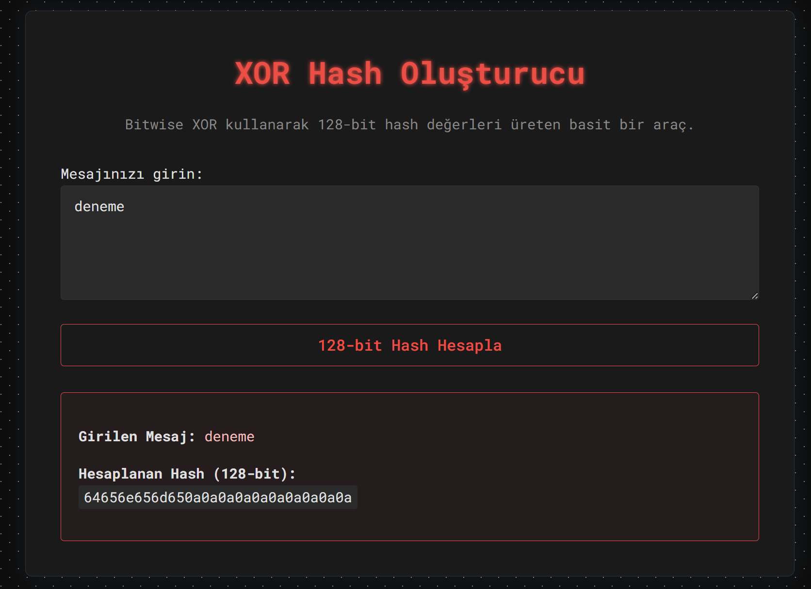
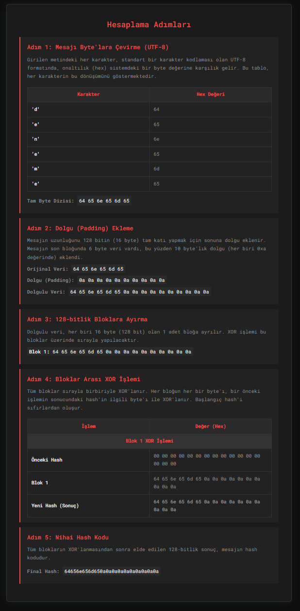

# Basit XOR Hash Fonksiyonu Web Uygulaması

Bu proje, bir mesajın 128-bitlik hash değerini "bitwise XOR" (özel veya) işlemi kullanarak hesaplayan basit bir web uygulamasıdır. Algoritma, verilen bir metni 128-bitlik bloklara ayırır ve bu blokları birbiriyle XOR'layarak nihai hash kodunu üretir.

Uygulama, hash işleminin her adımını (metnin byte'lara çevrilmesi, dolgu eklenmesi, blokların oluşturulması ve XOR işlemleri) detaylı bir şekilde göstererek algoritmanın çalışma mantığını anlamayı kolaylaştırır.

## Ekran Görüntüleri

Uygulamanın genel görünümü ve adım adım hash hesaplama detayları aşağıda gösterilmiştir.

**Ana Arayüz:**


**Hesaplama Adımları:**


## Algoritmanın Çalışma Mantığı

Hash fonksiyonu, aşağıdaki adımları izleyerek bir mesajı 128-bitlik bir özete dönüştürür:

1.  **Girdi (Mesaj):** Kullanıcı tarafından herhangi bir uzunlukta bir metin girilir.

2.  **Byte'lara Dönüştürme:** Metin, işlenebilmesi için standart bir karakter kodlaması olan UTF-8 formatında byte dizisine çevrilir.

3.  **Dolgu (Padding) İşlemi:** Hash algoritması, mesajı eşit uzunluktaki (128-bit veya 16-byte) bloklara bölerek çalışır. Eğer mesajın toplam uzunluğu 128 bitin tam katı değilse, son bloğun uzunluğunu 128 bite tamamlamak için sonuna "dolgu" (padding) verisi eklenir. Bu projede PKCS#7 standardına uygun bir dolgu yöntemi kullanılmıştır. Örneğin, son blokta 5 byte eksikse, sonuna 5 adet `0x05` değeri eklenir.

4.  **Bloklara Ayırma:** Dolgu işlemi yapılmış byte dizisi, her biri 16 byte (128 bit) olan `M` adet bloğa ayrılır.

5.  **XOR İşlemi:**
    -   128 bitlik (16 byte) ve tamamı sıfırlardan oluşan bir "sonuç" değişkeni oluşturulur.
    -   Tüm bloklar sırayla bu "sonuç" değişkeni ile bit bit XOR işlemine tabi tutulur.
    -   `Sonuç = Sonuç ⊕ Blok 1`
    -   `Sonuç = Sonuç ⊕ Blok 2`
    -   ...
    -   `Sonuç = Sonuç ⊕ Blok M`
    -   Bu işlem, tüm bloklar bitene kadar devam eder. Her bloğun her bir byte'ı, "sonuç" değişkeninin aynı pozisyondaki byte'ı ile XOR'lanır.

6.  **Çıktı (Hash Kodu):** Tüm blokların XOR'lanmasından elde edilen en son 128-bitlik "sonuç" değeri, mesajın hash kodudur. Bu değer, okunabilirliği artırmak için genellikle onaltılık (hexadecimal) formatta gösterilir.

## Teknolojiler

-   **Backend:** Python, Flask
-   **Frontend:** HTML, CSS

## Kurulum ve Çalıştırma

1.  **Depoyu klonlayın:**
    ```bash
    git clone https://github.com/mertusta2404/XOR-Hash-Function.git
    cd XOR-Hash-Function
    ```

2.  **Gerekli kütüphaneleri yükleyin:**
    Python için bir sanal ortam oluşturmanız önerilir.
    ```bash
    pip install -r requirements.txt
    ```

3.  **Uygulamayı çalıştırın:**
    ```bash
    python app.py
    ```

4.  **Tarayıcıda açın:**
    Web tarayıcınızı açın ve `http://127.0.0.1:5000` adresine gidin.